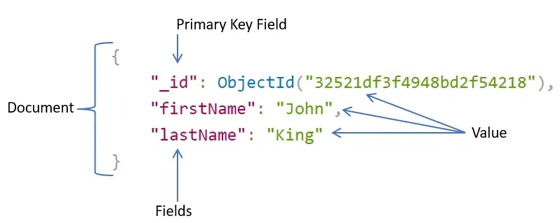
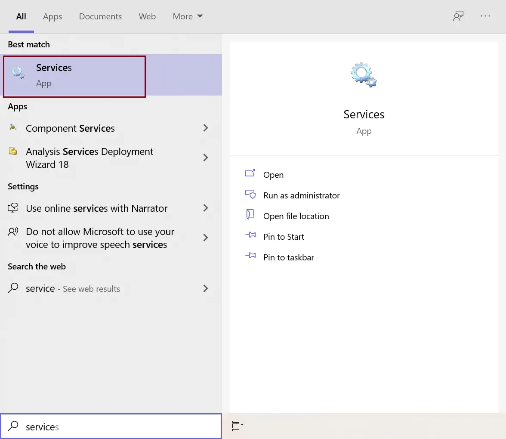
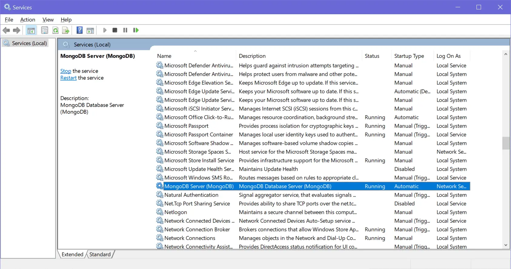
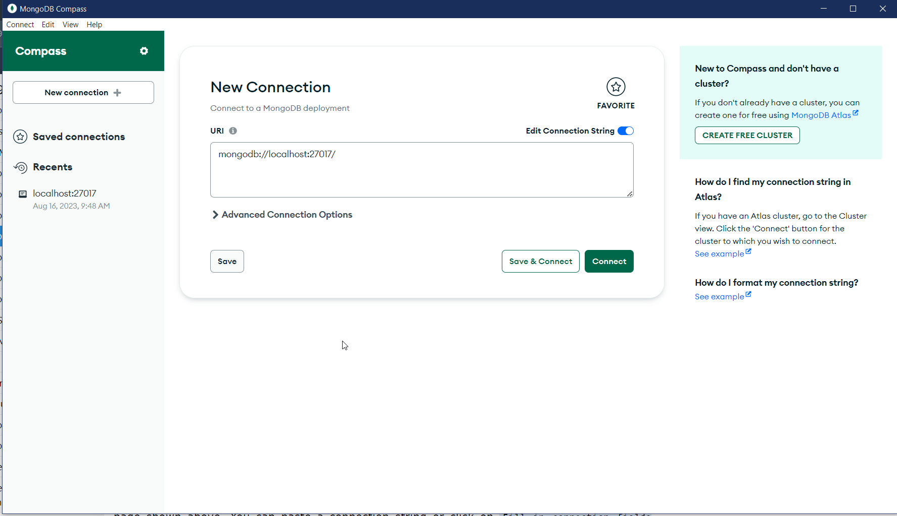
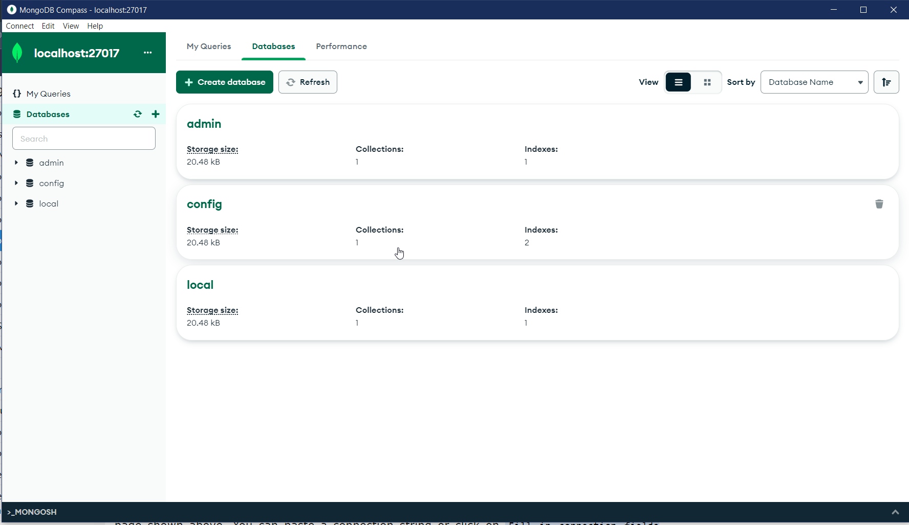
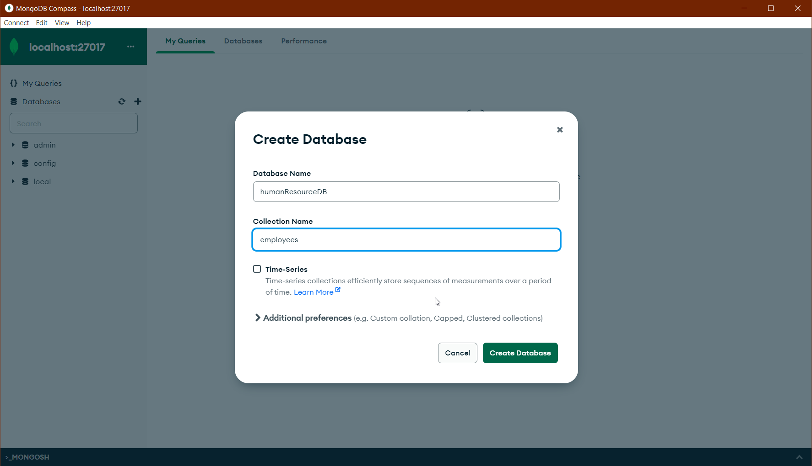
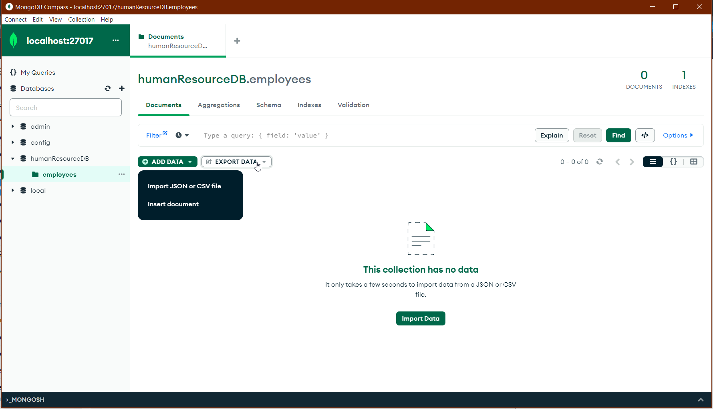
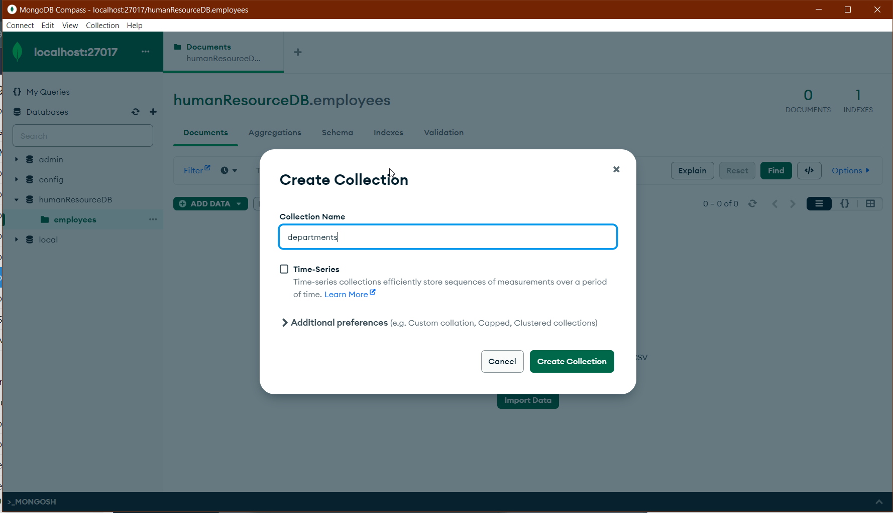

<div align="center">
  <h1>MongoDB Introduction and Installation</h1>
  <sub>Author:
<a href="https://www.linkedin.com/in/bhuvanaganesan-l-2209047a" target="_blank">Bhuvan Ganesan</a><br>
</sub>
</div>

<hr>

# Introduction

MongoDB is an open-source, cross-platform, and distributed document-based database designed for ease of application development and scaling. It is a NoSQL database developed by MongoDB Inc.

MongoDB name is derived from the word "Humongous" which means huge, enormous. MongoDB database is built to store a huge amount of data and also perform fast.

MongoDB is not a Relational Database Management System (RDBMS). It's called a "NoSQL" database. It is opposite to SQL based databases where it does not normalize data under schemas and tables where every table has a fixed structure. Instead, it stores data in the collections as JSON based documents and does not enforce schemas. It does not have tables, rows, and columns as other SQL (RDBMS) databases.

The following table lists the relation between MongoDB and RDBMS terminologies.

<table>
  <tr>
    <td>MongoDB (NoSQL Database)</td>
    <td>RDBMS (SQL Server, Oracle, etc.)</td>
  </tr>
  <tr>
    <td>Database</td>
    <td>Database</td>
  </tr>
  <tr>
    <td>Collection</td>
    <td>Table</td>
  </tr>
  <tr>
    <td>Document</td>
    <td>Row (Record)</td>
  </tr>
  <tr>
    <td>Field</td>
    <td>Column</td>
  </tr>
</table>

In the RDBMS database, a table can have multiple rows and columns. Similarly in MongoDB, a collection can have multiple documents which are equivalent to the rows. Each document has multiple "fields" which are equivalent to the columns. Documents in a single collection can have different fields.

#### Image


## Advantages of MongoDB

- MongoDB stores data as JSON based document that does not enforce the schema. It allows us to store hierarchical data in a document. This makes it easy to store and retrieve data in an efficient manner.
- It is easy to scale up or down as per the requirement since it is a document based database. MongoDB also allows us to split data across multiple servers.
- MongoDB provides rich features like indexing, aggregation, file store, etc.
- MongoDB performs fast with huge data.
- MongoDB provides drivers to store and fetch data from different applications developed in different technologies such as C#, Java, Python, Node.js, etc.
- MongoDB provides tools to manage MongoDB databases.

# Installation 

Go to link below download the current version msi file from community server 
Just double click and install with mongodb compass 

https://www.mongodb.com/try/download/community


## MongoDB Server
We installed MongoDB as a Network service. To see this, open Services by searching "service" in the windows search box and click on the Services app, as shown below.
#### Image


On the Services window, navigate to MongoDB Server, as shown below. You will find that it is already up and running.
#### Image


Now, the MongoDB Server service is already running, you can connect the MongoDB client to connect with this MongoDB server and execute the commands.


# MongoDB Compass

MongoDB Compass is a GUI based tools to interact with local or remote MongoDB server and databases. Use Compass to visually explore your data, run ad hoc queries, perform CRUD operations, and view and optimize your query performance. It can be installed on Linux, Mac, or Windows.

Now, do a window search on "mongodb compass" and open it, as shown below.
#### Image


On the main page, click on the New Connection tab on the left pane to open New Connection page shown above. You can paste a connection string or click on Fill in connection fields individually link. This will open the following window where you can enter the host name, port, username, password, etc.
#### Image


Now, you can create, modify, delete databases, collections, documents using MongoDB Compass. Click on the CREATE DATABASE button to create a new database. This will open Create Database popup, as shown below.
#### Image


Enter your database name and collection name and click Create Database. This will create a new database humanResourceDB with the new employees collection shown below.
#### Image


Thus, you can use MongoDB Compass UI to manage your MongoDB databases.

## Create Collection in MongoDB Compass

Click on plus icon near DB name and create collection as show in below screen 

add a new collection as departments
#### Image


## MongoDB Documents: Document, Array, Embedded Document

In the RDBMS database, a table can have multiple rows and columns. Similarly in MongoDB, a collection can have multiple documents which are equivalent to the rows. Each document has multiple "fields" which are equivalent to the columns. So in simple terms, each MongoDB document is a record and a collection is a table that can store multiple documents.

The following is an example of JSON based document.
#### Image


In the above example, a document is contained within the curly braces. It contains multiple fields in "field":"value" format. Above, "_id", "firstName", and "lastName" are field names with their respective values after a colon :. Fields are separated by a comma. A single collection can have multiple such documents separated by a comma.

The following chart to understand the relation between database, collections, and documents.
#### Image


The following is an example of a document that contains an array and an embedded document.


```
{
    "_id": ObjectId("32521df3f4948bd2f54218"),
    "firstName": "John",
    "lastName": "King",
    "email": "john.king@abc.com",
    "salary": "33000",
    "DoB": new Date('Mar 24, 2011'),
    "skills": [ "Angular", "React", "MongoDB" ],
    "address": { 
                "street":"Upper Street",
                "house":"No 1",
                "city":"New York",
                "country":"USA"
            }
}
```
MongoDB document stores data in JSON format. In the above document, "firstName", "lastName", "email", and "salary" are the fields (like columns of a table in RDBMS) with their corresponding values (e.g value of a column in a row). Consider "_id" field as a primary key field that stores a unique ObjectId. "skills" is an array and "address" holds another JSON document.

MongoDB stores data in key-value pairs as a BSON document. BSON is a binary representation of a JSON document that supports more data types than JSON. MongoDB drivers convert JSON document to BSON data.

### Important Points:

- MongoDB reserves _id name for use as a unique primary key field that holds ObjectId type. However, you are free to give any name you like with any data type other than the array.
- A document field name cannot be null but the value can be.
- Most MongoDB documents cannot have duplicate field names. However, it depends on the driver you use to store a document in your application.
- A document fields can be without quotation marks " " if it does not contain spaces, e.g. { name: "Steve"}, { "first name": "Steve"} are valid fields.
- Use the dot notation to access array elements or embedded documents.
- MongoDB supports maximum document size of 16mb. Use GridFS[https://docs.mongodb.com/manual/core/gridfs/] to store more than 16 MB document.
- Fields in a BSON document are ordered. It means fields order is important while comparing two documents, e.g. {x: 1, y: 2} is not equal to {y: 2, x: 1}
- MogoDB keeps the order of the fields except _id field which is always the first field.
- MongoDB collection can store documents with different fields. It does not enforce any schema.

### Embedded Documents:

A document in MongoDB can have fields that hold another document. It is also called nested documents.

The following is an embedded document where the department and address field contains another document.

```
{
    _id: ObjectId("32521df3f4948bd2f54218"),
    firstName: "John",
    lastName: "King",
    department: { 
                _id: ObjectId("55214df3f4948bd2f8753"), 
                name:"Finance"
            },
    address: {
        phone: { type: "Home", number: "111-000-000" }
    }
}
```
In the above embedded document, notice that the address field contains the phone field which holds a second level document.

An embedded document can contain upto 100 levels of nesting.
Supports a maximum size of 16 mb.
Embedded documents can be accessed using dot notation embedded-document.fieldname, e.g. access phone number using address.phone.number.


### Array

A field in a document can hold array. Arrays can hold any type of data or embedded documents.

Array elements in a document can be accessed using dot notation with the zero-based index position and enclose in quotes.

```
{
    _id: ObjectId("32521df3f4948bd2f54218"),
    firstName: "John",
    lastName: "King",
    email: "john.king@abc.com",
    skills: [ "Angular", "React", "MongoDB" ],
}

```

The above document contains the skills field that holds an array of strings. To specify or access the second element in the skills array, use skills.1.

